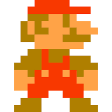

# 1 Titulares
# 2 Parrafo
# 3 comentarios
# 4 listas
# 5 Enlases
# 6 citas
# 7 linea divisoria
# 8 codigo
# 9 tablas
# 10 imagenes
# 11 caracter de escape
# 12 Github

# 1 Titulares
# 1
## 2
### 3
#### 4
##### 5
###### 6
# 2 Parrafo
*cursivas*
**negritas**
~~tachado~~

parrafo
# 3 comentarios
<!--Comentarios-->
# 4 listas
1. a
2. b
    1. c
    2. d

* 1
* 2
    * 1
    * 2
# 5 Enlases

[google](https://www.google.com/ "buscador")

# 6 Citas

>Esto es una cita

# 7 Linea divisoria

___

# 8 Codigo

```html
<p>parrafo</p>
```

# 9 tablas

|col1|col2|col3|
|---|---|----|
|a|1|2|
|b|3|4|
|c|5|6|


# 10 imagenes



# 11 carcter de escape

\*cursivas\*

# 12 Caractericticas de GitHub

* [x] 1
* [ ] 2
* [ ] 3

@mmagico571@gmail.com


:blush:
